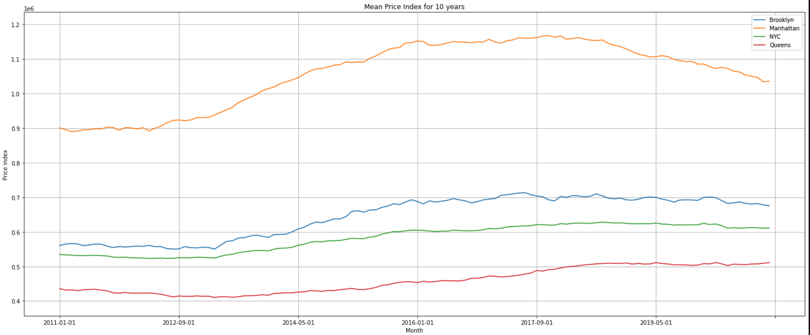
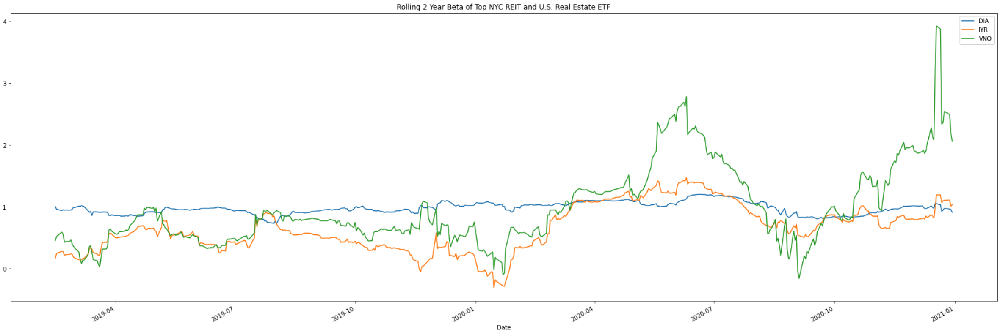
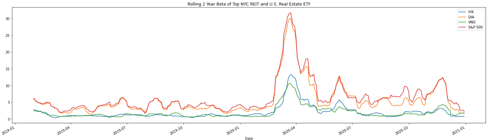
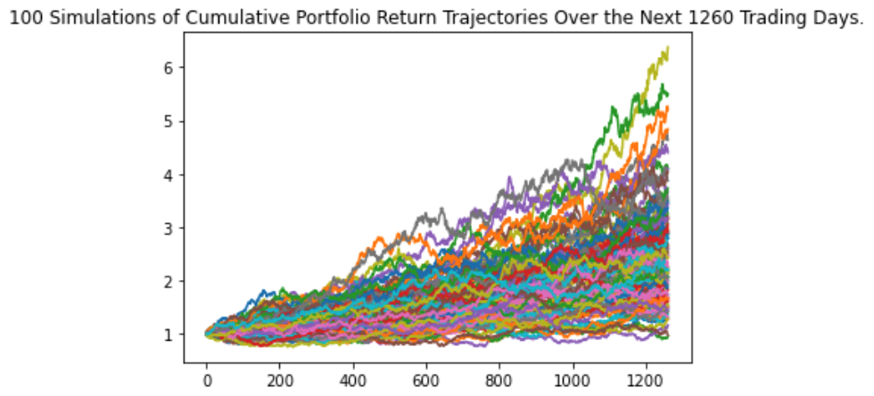
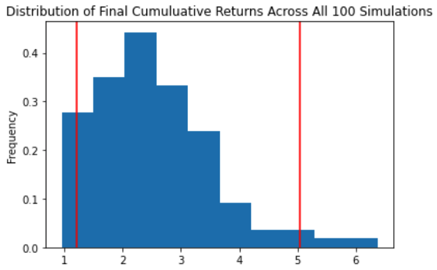
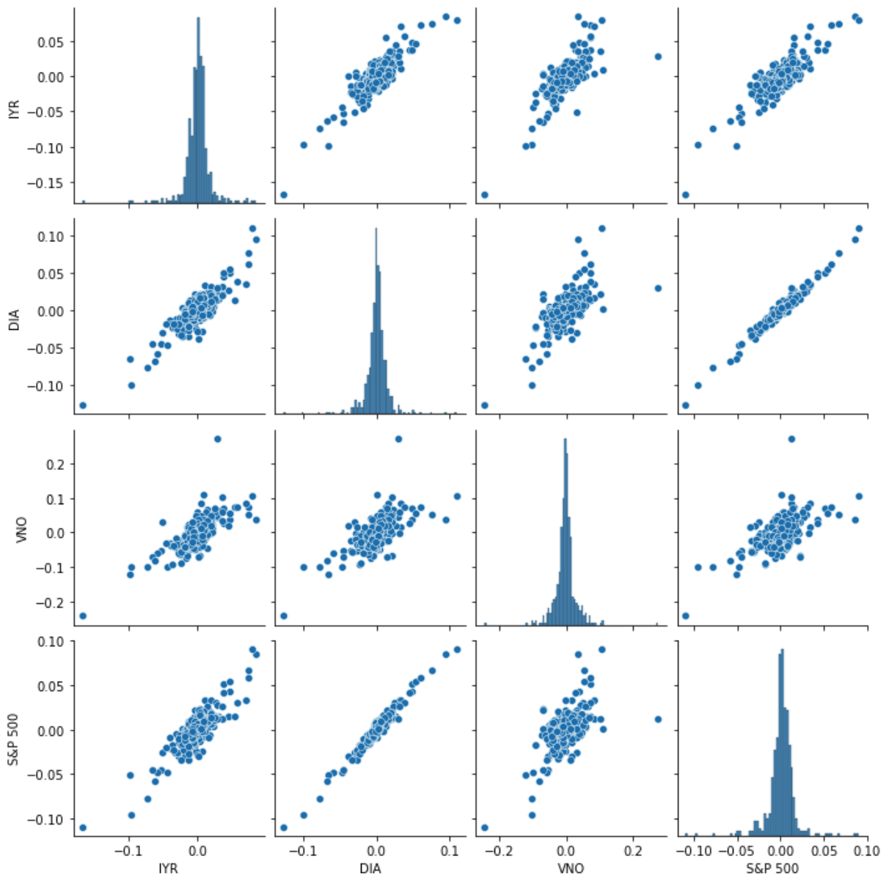
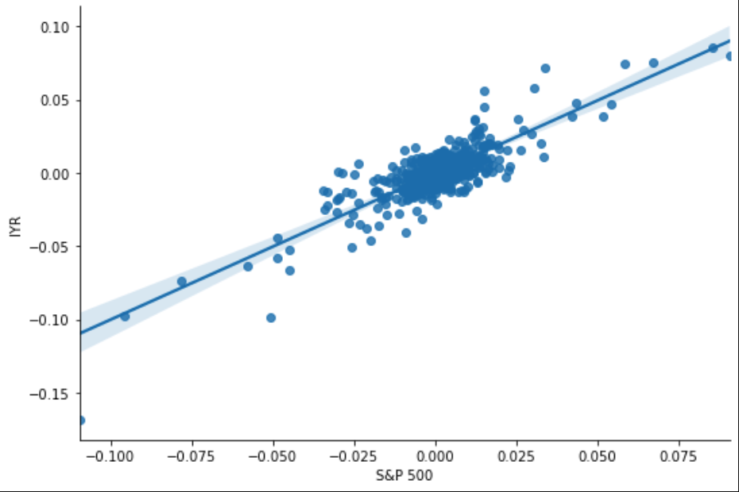
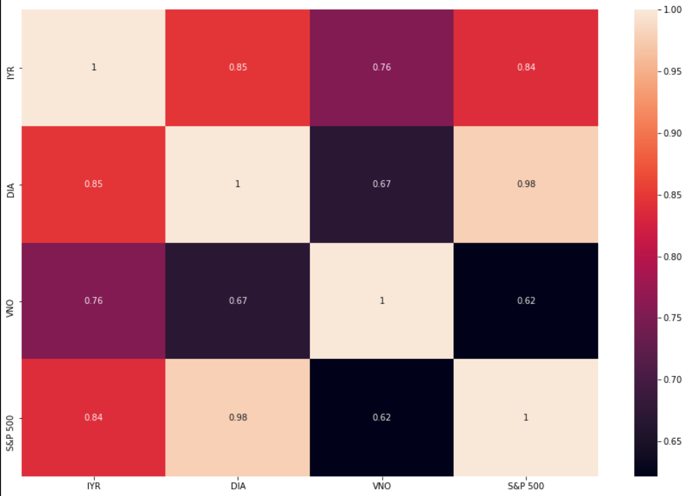

# US Real Estate Analysis 
**A guide by Yasir Malik, Valeriia Darkhanova, Susan Fan and Wes Sapone**


### **Data Source**

- We obtained the StreetEasyPrice Index using the Sales Data in Manhattan, Brooklyn, Queens and NYC, [All Home Type](https://streeteasy.com/blog/data-dashboard/?agg=Index&metric=StreetEasy%20Price%20Index&type=Sales&bedrooms=Any%20Bedrooms&property=Any%20Property%20Type&minDate=2010-01-01&maxDate=2020-12-01&area=Flatiron,Brooklyn%20Heights)
- We obtained past 2 years data for United States from [ZillowStatic](https://files.zillowstatic.com/research/public_v2/zhvi/Metro_zhvi_uc_sfrcondo_tier_0.33_0.67_sm_sa_mon.csv)


### **Data Cleaning and Preparation**

Set Paths and Read CSVs
```python
iyr_data = Path("resources/IYR.csv")
iyr_df = pd.read_csv(iyr_data, index_col="Date", parse_dates=True, infer_datetime_format=True)
```
Combine Dataframes
```python
combined_df = pd.concat([iyr_df, dia_df, vno_df, sp500_df], axis="columns", join="inner")
combined_df.sort_index()
combined_df.columns = ["IYR", "DIA", "VNO", "S&P 500"]
```

### **Calculation**

```python
#Calculate daily returns of closing prices
daily_returns = combined_df.pct_change().dropna()

# Calculate covariance of all daily returns
iyr_covariance_mkt = daily_returns['IYR'].cov(daily_returns['S&P 500'])

# Calculate variance of all daily returns
mkt_variance = daily_returns['S&P 500'].var()

# Calculate beta of all daily returns versus the S&P 500 ("The Market")
iyr_beta_mkt = iyr_covariance_mkt / mkt_variance
dia_beta_mkt = dia_covariance_mkt / mkt_variance
vno_beta_mkt = vno_covariance_mkt / mkt_variance

print(f"IYR: {iyr_beta_mkt} | DIA: {dia_beta_mkt} | VNO: {vno_beta_mkt}")
```
#### **Monte Carlo Simulation**
Run 100 simulations in 5 years
```python
from MCForecastTools import MCSimulation

MC_fiveyear = MCSimulation(
    portfolio_data = df_ticker,
    weights = [.25,.25,.25,.25],
    num_simulation = 100,
    num_trading_days = 252*5
)

line_plot = MC_fiveyear.plot_simulation()
line_plot.get_figure().savefig("MC_fiveyear_sim_plot.png", bbox_inches="tight")
```
### **Plots**


















